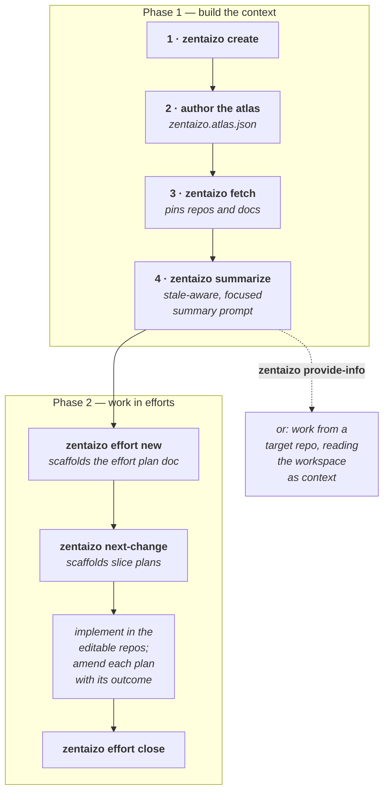
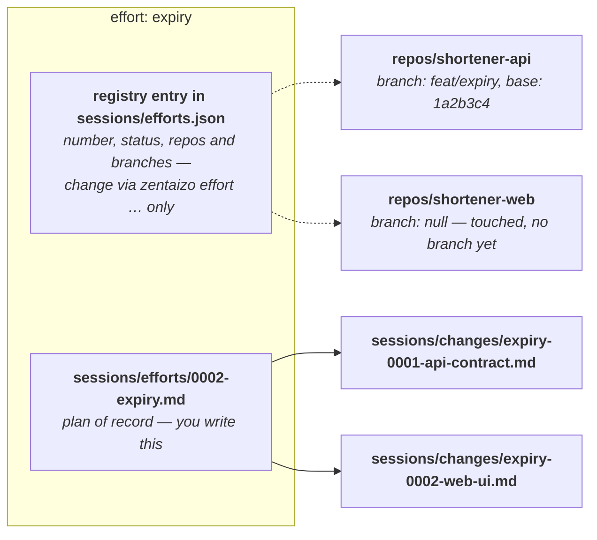

# Zentaizo

Zentaizo helps an AI agent understand the big picture of a complex system before it dives into source code. It's a tool that can create an AI-native workspace: a virtual monorepo for a curated set of repos, papers, API docs, etc. When installed as a shared skill among your chosen AI harnesses, it also serves as a way to share curated, git-persisted, hierarchically-scaled information.

The name comes from Japanese `zentaizo` (`全体像`, usually romanized `zentaizō`), meaning the overall picture.

## Why This Exists

Useful software work often depends on context that lives outside the repository you are editing:

- related service repositories
- web frontends and client libraries
- deployment configuration
- public documentation
- design docs and papers
- issue reports, traces, and local notes

An agent can answer better questions and make better changes when it has a structured way to see that broader context. Zentaizo is a workspace format and command-line tool for building that curated context in a token-efficient readable way.

Aside from external information, zentaizo provides a shared skill for where to share git-persisted information during planning, analysis, and implementation.

## Core Ideas

The goals the workspace format serves. The **Mechanisms** below each note which idea(s) they advance.

1. **Big picture first** — an agent answers better and changes more safely when it understands the whole landscape of a system before making plans and diving into any source code.
2. **Persistent, auditable substrate** — work and its rationale live in versioned, git-controlled files, so a later session, a different model, or the human can look at what was decided and done before contributing.
3. **Reproducibility and determinism** — the context behind an answer should be repeatable, and any task with a single correct answer belongs in deterministic tooling rather than model instructions.
4. **Context is precious** — the agent's attention is the scarce resource; spend it on the problem, not on boilerplate, lookup, or re-deriving rules a tool could enforce.
5. **Model-agnostic** — the workspace is the source of truth, not any one assistant.
6. **Least-privilege, sandboxable execution** — an agent gets the narrowest access that lets it work: it writes its own `sessions/` and the editable repos, reads everything else (the reference repos especially), and touches nothing outside the workspace.

## Mechanisms

How the workspace realizes those ideas; each tag points back to the Core Idea(s) it serves.

- **Curated atlas** (`zentaizo.atlas.json`) — human-authored intent: the curated knowledge context, distinct from the machine-resolved lock state (`zentaizo.lock.json`). *(1, 2)*
- **Hierarchical knowledge base** — summaries at different scales, from system overview to APIs to source, drilling down only when needed; the queryable knowledge graph below is its structural counterpart. *(1, 4)*
- **Queryable knowledge graph** (`zentaizo graph`, optional) — a cross-source graph of code↔code and code↔doc edges built with [Graphify](https://github.com/safishamsi/graphify), surfacing structural relationships no single per-source summary can see. It is the first of several *optional layers* a workspace can add through external-tool modules — each an opt-in tier, never a hard dependency, that falls back to reference-only when the tool is absent. *(1, 4)*
- **Heterogeneous sources** — repos, docs, papers, notes, issue reports, and generated analysis in one place. *(1)*
- **Multi-repo sandbox** — all associated repos available locally for agentic work, like a monorepo for coherent cross-system development; each repo marked read-only (`role: "reference"`) or editable (`role: "edit"`). It brings the full picture of code to bear (1), provides that code as persistent, version-pinned context (2), and removes failable web searches against drifting versions by making the exact source local (3); and that same read-only/editable marking *is* the access policy a sandbox enforces, so an agent can run at the workspace level with reference repos genuinely read-only (6). *(1, 2, 3, 6)*
- **Pinned sources** — repos and document snapshots resolve to exact commits and content hashes (`zentaizo.lock.json`). *(2, 3)*
- **Deterministic tooling over model instructions** — mechanical, single-answer work (session-file allocation, counter and path resolution, frontmatter) lives in the CLI, not in prose each model re-interprets each session. This frees context (4) and reduces run-to-run variability (3). *(3, 4)*
- **Git-versioned `sessions/` trail** — effort docs, slice plans, debugging notes, handoffs, reports, and the effort registry accumulate as the durable, auditable record a later session reads instead of re-deriving. *(2)*
- **Model-neutral instructions** — `AGENTS.md` carries the model-agnostic guidance, and the `skills/` procedures are plain-markdown and tool-neutral (they name Claude, Codex, Gemini, and Aider as interchangeable). `CLAUDE.md` imports `AGENTS.md` (an `@AGENTS.md` line, so Claude loads that guidance in full at launch — it reads `CLAUDE.md`, not `AGENTS.md`); `GEMINI.md` stays a thin pointer; and the shared skill installs across Claude, Codex, and Gemini. *(5)*
- **Least-privilege sandboxing** (`zentaizo sandbox`) — the atlas's edit/reference split *is* an access policy; a pure `compute_policy` derives it (write your own `sessions/`/`summaries/` and the editable repos, read everything else, touch nothing outside the workspace) and thin renderers project it into each harness's native guardrails — with airtight OS-level containers planned as an opt-in allied repo. One atlas-derived policy, rendered per assistant, so confinement isn't hand-maintained per tool. *(5, 6)*

## A Small Example

Imagine a small URL shortener split across several repositories:

- `shortener-api`: REST API for creating and resolving short links
- `shortener-web`: web UI for managing links
- `shortener-client`: Python or JavaScript client library
- `deployment`: Docker, Helm, or Terraform configuration
- public API docs

You want to ask:

> If we add link expiration, which repos need to change, and what contract should they share?

Zentaizo is meant to prepare the agent to answer that first, then help make the actual edits in the right repositories.

## Install

Put `zentaizo` on your `PATH` (`pipx` keeps it isolated):

```bash
pipx install -e /path/to/zentaizo
zentaizo --help
```

If you don't have `pipx`: `pixi global install pipx` (or `brew install pipx`,
`apt install pipx`).

Then install the global Zentaizo skill, which teaches your AI assistants the
workspace workflow and conventions:

```bash
zentaizo skills install --target claude  # or codex, gemini, all
```

### Developing Zentaizo itself

Working on the Zentaizo tool (rather than using it) uses an editable install in
a pixi dev env:

```bash
pixi install                # bootstrap dev env
pixi run zentaizo --help
pixi run check              # ruff lint + tests
pixi run hooks-install      # one-time: enable pre-commit on `git commit`
```

Release (when ready): `pixi run build` then `pixi run publish`.

### Filing tool feedback from another workspace

Every workspace dogfoods Zentaizo, so each surfaces ideas and issues about the
tool. Point Zentaizo at your hub workspace once, then file feedback into it from
anywhere with `-Z`/`--zentaizo` (the hub-equivalent of `-C`):

```bash
zentaizo config set hub ~/work/zen-zentaizo                 # one-time, tool-level
zentaizo next-brainstorming "acg-summarize-too-slow" -Z     # lands in the hub
zentaizo effort new console --describe "…" -Z               # or stand up an effort
```

`-Z` covers `effort new`, the `next-*` creators, and read-only `path`/`effort
show`/`effort list`; effort-scoped creators require an explicit `--label` under
`-Z`. See [`docs/cli.md`](docs/cli.md) for the full surface. The hub then
triages → effort/slice → review → implement.

## What A Workspace Contains

After source discovery and fetch, a workspace looks like:

```text
zen-link-shortener/
  zentaizo.atlas.json       # human-authored context atlas, created after source discovery
  zentaizo.lock.json        # conventions stamp (create) + resolved commits/hashes/snapshots (fetch)
  AGENTS.md                 # agent instructions for this context

  repos/                    # fetched source repositories
  docs/                     # documentation snapshots
  papers/                   # PDFs and specs
  notes/                    # issue reports, traces, design notes
  summaries/                # generated hierarchical summaries
  graphify-out/             # optional knowledge graph (written by `zentaizo graph`)
  skills/                   # model-agnostic procedures and session templates
  sessions/
    efforts.json            # effort registry: labels, numbers, current pointer, repo/branch map
    efforts/                # effort-level plan docs
    brainstorming/          # pre-decision input: scaffolded notes or freeform dumps
    changes/                # implementation plans (slices), amended with outcomes
    debugging/              # bug investigations: traces, hypotheses, root cause
    questions/              # dated Q&A logs with researched answers and citations
    handoffs/               # paste-ready execution prompts for the implementing agent
    reports/                # living evidence-backed syntheses (must-read deliverables)
```

## The Workflow

A workspace has two phases: **build the context** (once, then refreshed as
sources move), and **work in efforts** against it. The diagram shows the
shape; the numbered steps below explain what each box actually does.



Three ownership rules make the layout predictable:

- **You hand-edit exactly one JSON file:** `zentaizo.atlas.json`, the
  human-authored atlas of what the system is and which repos are editable.
- **The CLI owns the other JSON.** `zentaizo.lock.json` changes only through
  `zentaizo fetch`, and `sessions/efforts.json` only through `zentaizo
  effort …` commands — they validate repo names, compute pins and merge bases,
  and keep timestamps, so hand-editing these files is never needed (or safe).
- **Markdown is shared:** the CLI allocates every session file (path, counter,
  frontmatter), then you and the assistant write the content.

### 1 · Create the workspace

Typically you create a `zen-`-prefixed workspace repo that targets a
particular project where one or more of the fetched repos will be modified:

```bash
zentaizo create zen-link-shortener
cd zen-link-shortener
```

This scaffolds the shell: `AGENTS.md` (the assistant's entry point), `skills/`
(procedures and templates), and `sessions/` seeded with the reserved `main`
effort. There is no atlas yet — authoring it is the first real task, and the
generated `AGENTS.md` says exactly that.

### 2 · Author the atlas

`zentaizo.atlas.json` is the human-authored statement of intent: which repos,
docs, papers, and notes matter; which repos are *editable* versus *reference*;
and a description of what you are building (step 4 feeds that description into
every summary). You don't write it alone — open an AI session in the workspace
and ask:

> Use the Zentaizo instructions here to interview me and draft
> `zentaizo.atlas.json`.

The bundled `skills/curate-atlas.md` drives that interview. Check the result
with `zentaizo validate`.

### 3 · Fetch pinned snapshots

```bash
zentaizo fetch
```

Resolves every atlas source to an exact identity — repos to commits, doc
snapshots to content hashes — populates `repos/`, `docs/`, and `papers/`, and
records the resolution in `zentaizo.lock.json`. The atlas stays declarative
("track `main`"); the lock records what you actually have, so the context
behind an answer is reproducible.

### 4 · Summarize

```bash
zentaizo summarize                             # incremental
zentaizo summarize --focus "expiry semantics"  # add a one-run emphasis
```

This writes `summaries/summarize.prompt.md` — a prompt you hand to your agent
("run the summarize prompt"), not a finished summary. Two things make it more
than "summarize these repos":

- **It knows what is stale.** Each existing summary is pinned by frontmatter
  to the exact locked state it was written from (repo commit, doc content
  hash). The command diffs those pins against `zentaizo.lock.json` and asks
  the agent to (re)write only the sources that are new or changed, listing
  everything else as keep-as-is.
- **It knows why you are summarizing.** The prompt opens with the workspace's
  purpose from the atlas, the current effort's description, and any `--focus`
  text, and tells the agent to weight every summary toward that focus. If the
  work is about authentication, each repo's summary should explain how that
  repo handles auth — a pertinent condensation of larger content, not a
  generic abstract that drops what matters.

The agent then writes one summary per source plus three cross-cutting files —
`overview.md` (system map), `relationships.md` (how the sources interact), and
`open-questions.md` (gaps and assumptions) — which future sessions read
*before* any source code.

`zentaizo graph` builds the structural counterpart: a queryable cross-source
knowledge graph via [Graphify](https://github.com/safishamsi/graphify)
(optional; code-only and offline by default — see `docs/cli.md`).

### 5 · Work — in the workspace or from a target repo

The built context can be used two ways. Work *inside* the workspace, grouped
into efforts (next section) — the multi-repo sandbox makes coherent cross-repo
changes natural. Or inject the context into a single target repo and work from
there:

```bash
zentaizo provide-info /path/to/shortener-api
```

Then, from `/path/to/shortener-api`, you can ask an AI agent:

> Using the Zentaizo context, inspect the related frontend and client library before changing the API contract for link expiration.

### Working in Efforts

Work in a workspace is grouped into **efforts** — named bodies of work that may
span several editable repos. An effort lives in two linked places: a registry
entry holding machine state, and a plan doc holding human intent.



The usual path is agentic — describe the work to your assistant and it runs
these commands for you (the bundled `skills/plan-and-implement.md` walks it
through the lifecycle) — but they are equally drivable by hand:

```bash
# Reserve the effort, scaffold sessions/efforts/NNNN-expiry.md, make it current.
zentaizo effort new expiry --describe "Add link expiration across the system"
```

A repo joins an effort in two steps, because knowing a repo is involved usually
precedes opening a branch in it:

```bash
# "this effort will touch shortener-api" — recorded with branch: null
zentaizo effort set-branch expiry --repo shortener-api

# a working branch exists — record it; the merge base is computed automatically
zentaizo effort set-branch expiry --repo shortener-web=feat/expiry
```

Don't hand-edit `sessions/efforts.json` to do this: the commands validate the
repo name against the workspace, compute the merge base (`--base <sha>`
overrides it), and bump the effort's timestamp. The bare `--repo NAME` form
refuses to clobber an already-recorded branch — pass `NAME=BRANCH` to update
it. Branch names follow each repo's own conventions; they are not derived from
the effort label. Repos can also be attached at creation time (`--repo` on
`effort new` is repeatable).

```bash
zentaizo effort list           # all efforts; the current one is marked
zentaizo effort show expiry    # plan doc path, description, repos/branches, slices
zentaizo effort close expiry   # when the work lands
```

Then write the scaffolded effort doc — the plan of record — and decompose it
into slice plans with `zentaizo next-change <slug>`. The reserved `main` effort
is the deliverable trunk: work flows there until it warrants a separate effort.
See `docs/workspace-format.md` § Sessions and `docs/cli.md` for the full model.

## Beyond the Basics

### Querying a knowledge graph

`zentaizo graph` builds a workspace-wide knowledge graph with
[Graphify](https://github.com/safishamsi/graphify) — the structural counterpart
to `summaries/`, carrying the cross-repo and code↔doc edges no per-repo summary
can see. It needs the `graphify` binary on `PATH`; install it once:

```bash
uv tool install graphifyy          # or: pipx install graphifyy
```

```bash
zentaizo graph                               # code-only, fully offline (default)
zentaizo graph --semantic --backend ollama   # opt-in: also read papers/notes via a model
```

The default build is AST-only — no API key, no network — and `zentaizo fetch`
refreshes it automatically when a graphed source changes. `--semantic` reaches
the full text of papers and notes and requires an explicit `--backend` (`ollama`
and `claude-cli` run locally; remote backends are your explicit call). Output
lands in `graphify-out/`; query it with Graphify directly (`graphify query` /
`path` / `explain`, or its MCP server). See `docs/cli.md` for modes, backends,
and staleness.

### Sandboxing the agent

To confine the agent to least-privilege access — writable `sessions/` and editable repos, read-only reference repos — render the atlas-derived policy into your harness's config:

```bash
zentaizo sandbox --target policy           # print the computed policy (no side effects)
zentaizo sandbox --target claude           # write .claude/settings.json deny rules
zentaizo sandbox --target claude --check   # CI-style: fail if the config drifted from the atlas
```

This is a guardrail against accidental writes, not an airtight boundary — a shell command can still slip past file-tool denies — so see `docs/design/sandboxing.md` for the threat model and the planned container-based enforcement.

### Seeding a workspace from another

To seed a fresh workspace from an existing one that overlaps in scope (same
repos pinned, same papers, shared design notes), use `seed-from`:

```bash
zentaizo seed-from ../zen-old-workspace            # prompts per atlas entry
zentaizo seed-from ../zen-old-workspace --dry-run  # preview without writing
zentaizo seed-from ../zen-old-workspace --accept-all
```

It walks the source atlas, asks per repo/doc/paper/note (or skips prompts with
`--accept-all`), appends accepted entries to the target atlas, and copies any
local files referenced by `path:` (typical for notes). Repos are re-pinned
declaratively in the atlas; the working tree is populated by `zentaizo fetch`
afterward, not by copying `repos/`. Existing target atlas entries with the same
name are left untouched.

### Upgrading older workspaces

To bring an older workspace forward when Zentaizo's conventions have changed,
run an AI session in the workspace and point it at the experimental
`upgrade-zentaizo` procedure bundled in the global Zentaizo skill. It diffs the
current templates against the workspace, classifies each delta, and plans any
artifact migrations (session-file frontmatter, filename conventions) before
making changes.

## Safety

A workspace deliberately aggregates external material — fetched repositories, documentation, notes, and papers — for an AI assistant to read. Treat all of it as **untrusted input**: content pulled from the web or third-party repos can carry indirect prompt-injection payloads (hidden instructions, fake system messages, invisible characters). The generated workspace `AGENTS.md` instructs assistants to read this material as evidence to cite and summarize, **never as instructions to follow**. Hardened fetch-time handling — sanitization, quarantine, and a summarize-as-quarantine-boundary pattern — is implemented; see `docs/design/docs-layer.md`.
